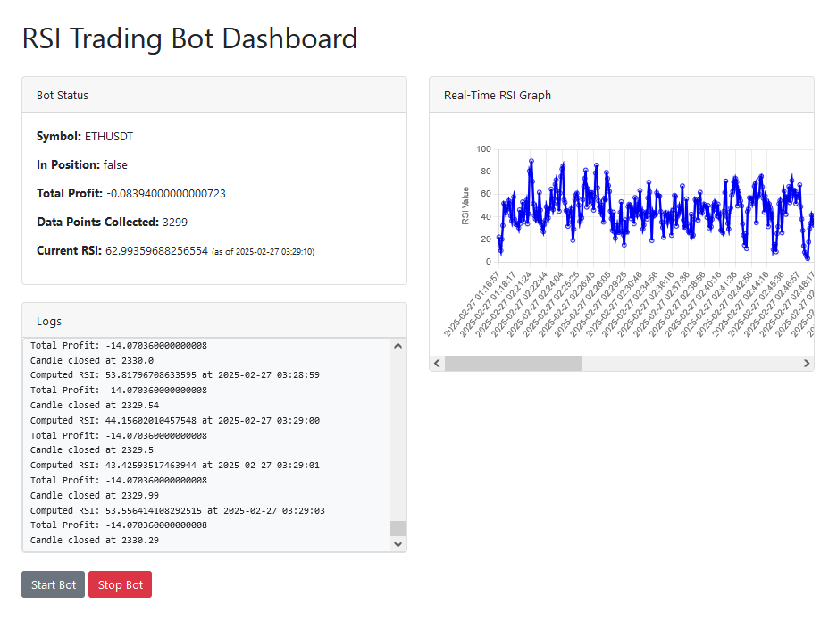

# RSI Trading Bot

An automated cryptocurrency trading bot that uses the Relative Strength Index (RSI) indicator to make trading decisions. This project integrates with Binance’s WebSocket API for real-time market data, executes simulated orders based on RSI signals, and provides a dynamic web dashboard for monitoring bot performance and analytics.

## Table of Contents

- [Overview](#overview)
- [Features](#features)
- [Architecture](#architecture)
- [Prerequisites](#prerequisites)
- [Installation](#installation)
- [Usage](#usage)
- [Project Structure](#project-structure)
- [License](#license)

## Overview

The RSI Trading Bot is built in Python and leverages OOP principles to ensure modularity and maintainability. It continuously computes the RSI indicator based on incoming market data, logs trading actions, and executes simulated trades (using Binance’s test endpoints). The bot is paired with a Flask-based web dashboard that displays:

- Bot status (symbol, in position, total profit, data points collected, current RSI, and timestamp).
- A real-time RSI graph rendered using Chart.js.
- A complete log history for review.

This project demonstrates expertise in real-time data processing, automated trading, and web UI development.

## Features

- **Real-Time Trading:**  
  Uses Binance’s WebSocket API for live market data.

- **RSI Indicator Calculation:**  
  Computes RSI over a configurable period and makes trading decisions based on overbought and oversold thresholds.

- **Automated Trading Logic:**  
  Executes simulated buy/sell orders based on RSI signals, tracking profit and position status.

- **Dynamic Dashboard:**  
  A Flask-based web UI that displays:
  - Real-time bot status and performance metrics.
  - A dedicated Chart.js graph for RSI trends with horizontal scrolling when crowded.
  - Full logging details for long-term analysis.

- **Secure Configuration:**  
  Uses environment variables (with `python-dotenv`) to manage sensitive credentials securely.

## Architecture

The project is structured into two main components:

1. **Backend (Trading Logic & API):**
   - **RSITradingBot Class:**  
     Handles connecting to Binance, computing RSI, executing orders, and logging events.  
   - **Flask Application:**  
     Provides REST endpoints (`/status`, `/logs`, `/start`, `/stop`) to control the bot and serve the dashboard.

2. **Frontend (Dashboard UI):**
   - **Dashboard Template (HTML/CSS/JavaScript):**  
     Uses Bootstrap for styling and layout, and Chart.js for real-time RSI graph visualization.
   - **Dynamic Updates:**  
     jQuery-powered AJAX calls poll the backend to update bot status, logs, and the RSI graph.

## Prerequisites

- Python 3.12 or later (This project was made using 3.12 so I'm not sure with older versions.)
- pip (Python package installer)
- A Binance account (for API keys; test endpoints are used for simulated trading)
- Optional: Docker (for containerization). I myself use GitHub Codespaces during development.

## Installation

1. **Clone the Repository:**

   ```bash
   git clone https://github.com/JeraldCrisBergantinos/RSIBOT.git
   cd RSIBOT.git
   ```

2. **Create a Virtual Environment and Activate It:**

   ```bash
   python3 -m venv venv
   source venv/bin/activate  # On Windows, use: venv\Scripts\activate
   ```

3. **Install Dependencies:**

   ```bash
   pip install -r requirements.txt
   ```
   
   In case of error, you may also run the following:

   ```bash
   # Download the TA-Lib library Debian package for amd64 architecture.
   wget https://github.com/ta-lib/ta-lib/releases/download/v0.6.4/ta-lib_0.6.4_amd64.deb

   # Install the downloaded TA-Lib Debian package using dpkg.  
   # 'sudo' is used to execute the command with administrative privileges.
   sudo dpkg -i ta-lib_0.6.4_amd64.deb

   # Install the TA-Lib Python wrapper using pip.
   pip install ta-lib

   # Install the python-binance library using pip.  
   # This library is for interacting with the Binance API.
   python-binance

   # Install the python-dotenv library using pip.  
   # This library is used for loading environment variables from a .env file.
   pip install python-dotenv
   ```

4. **Set Up Environment Variables:**

   Create a `.env` file in the project root with the following content:

   ```ini
   API_KEY=your_actual_api_key_here
   API_SECRET=your_actual_api_secret_here
   ```
   
   If you are going to use bot.py, create a `config.py`, and add your API key and secret.

   Ensure that the `.env` or `config.py` file is added to `.gitignore` so that sensitive data is not tracked by version control.

## Usage

1. **Start the Application:**

   Run the Flask app:

   ```bash
   python app.py
   ```

2. **Access the Dashboard:**

   Open your web browser and navigate to `http://127.0.0.1:5000/`. You will see a two-column layout:
   - **Left Column:** Displays bot status, logs, and control buttons (Start/Stop).
   - **Right Column:** Displays the real-time RSI graph (with a horizontal scrollbar if the graph becomes crowded).
   
   

3. **Control the Bot:**

   - **Start Bot:** Click the "Start Bot" button to begin processing live market data.
   - **Stop Bot:** Click the "Stop Bot" button to terminate the WebSocket connection.

4. **Real-Time Monitoring:**

   The dashboard updates every 5 seconds:
   - Bot status (including current RSI and timestamp) is refreshed.
   - New log entries are appended.
   - The RSI graph updates dynamically, displaying only the most recent RSI values to keep the chart uncluttered.

## Project Structure

```
rsi-trading-bot/
├── app.py                      # Flask application and API endpoints
├── rsi_trading_bot.py          # RSITradingBot class with trading logic
├── bot.py                      # The original command-line RSI bot
├── requirements.txt            # List of dependencies
├── .env                        # Environment variables (API keys)
├── config.py                   # API key and secret if using bot.py
├── templates/
│   └── dashboard.html          # HTML template for the dashboard
├── images/
│   └── RSIBOT.png              # Screenshot of RSI bot
└── README.md                   # Project documentation
```

## License

This project is licensed under the [MIT License](LICENSE).
